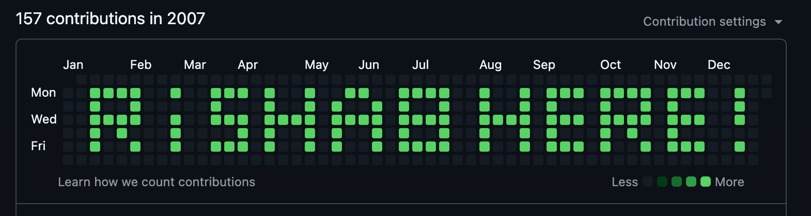

<p align="center">
      
    </p>

Instantly design and automate GitHub contribution graphs with smart commit scheduling

## Preview


<br><br>


## Live Proof

[SEE IT YOURSELF](https://github.com/rishabnotfound?tab=overview&from=2007-12-01&to=2007-12-31)



## Development

```bash
# Install dependencies
npm install

# Dev server
npm run dev

# Build
npm run build

# Preview build
npm run preview
```


## License

[MIT](LICENSE)

## Credits

Built by [rishabnotfound](https://github.com/rishabnotfound)
